# Якинатор - многопользовательская браузерная игра на Java с использованием Spring MVC фреймворка

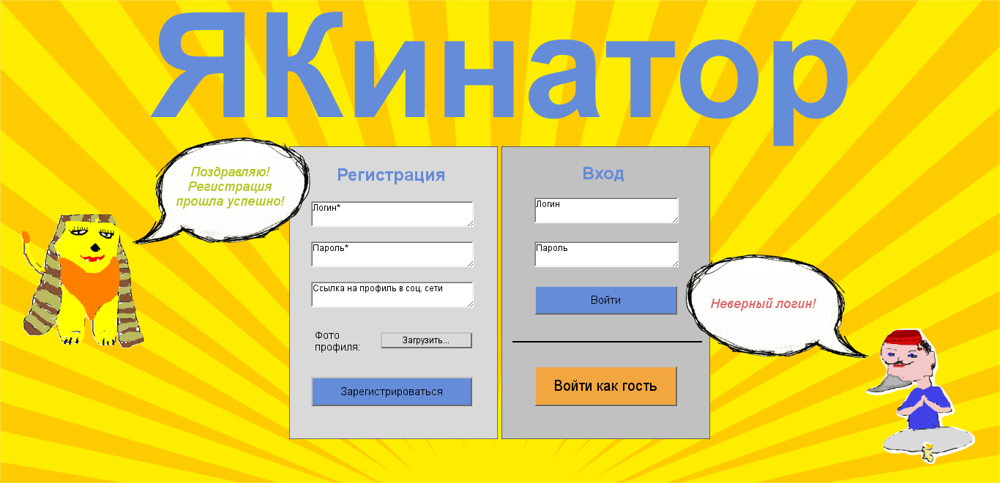
*Страница авторизации*

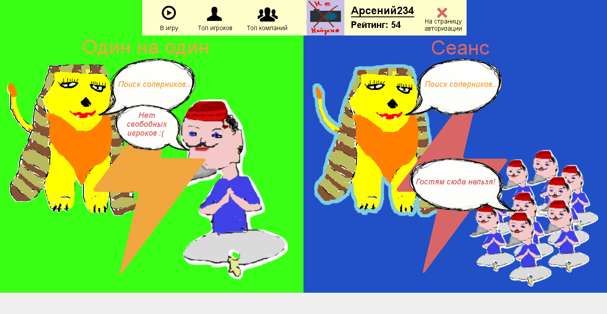
*Страница выбора режима игры*

## Краткое описание
Данное приложение является аналогом известной игры «Акинатор», но в качестве главного персонажа Джина выступает не бот, а такой же пользователь игры, как и загадывающий. Таким образом, игра строится на диалоге двух зарегистрированных пользователей. Каждый игрок обладает профилем, на котором накапливается рейтинг по результатам участия в играх. На основе этого рейтинга в «Якинаторе» формируется топ лучших участников.

Суть игры состоит в том, что один игрок, Сфинкс, загадывает персонажа, а другой, Якинатор, пытается разгадать, задавая наводящие вопросы. При этом Сфинкс может отвечать Якинатору лишь одной из пяти возможных фраз: «да», «нет», «возможно», «вряд ли», «не знаю». 

## Требования
- java 8
- maven 3.3.9

## Команда запуска
```
mvn clean package
```

## Подробное описание
Любой пользователь сайта может зарегистрироваться и получить свой личный профиль с логином и паролем. Все достижения пользователя прикрепляются к его профилю.

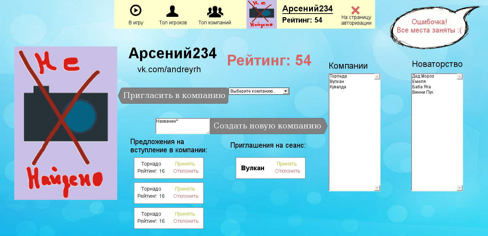
*Профиль пользователя*

В приложении «Якинатор» поддерживаются такие виды созтязаний как «Один на один» и «Сеанс». Рассмотрим подробнее каждое из них.

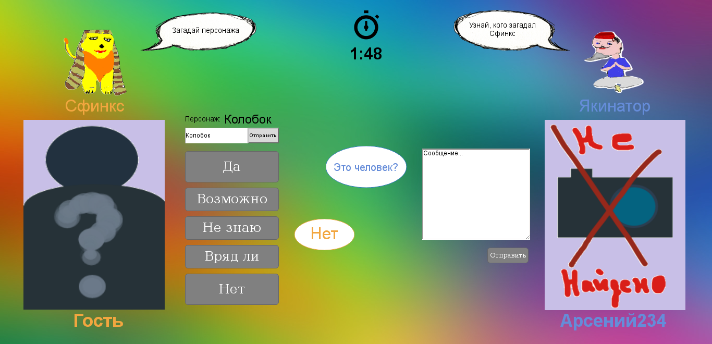
*Игра "Один на один"*

В игре «Один на один» Сфинкс, должен загадать персонажа и вписать его в соответствующее поле. После начала игры это поле нельзя будет изменить. Как только слово загадано второй игрок, Якинатор, может написать вопрос Сфинксу. А второй в свою очередь отвечает на вопрос одной из 5 фраз, оговоренных выше. Время на ход ограничено 2 минутами. Если игрок не успевает сделать ход, игра завершается. Если в сообщении, отправленном Якинатором, присутствует слово, указанное в поле загаданного персонажа, игра завершается. Если Якинатор отгадывает персонажа, данный персонаж заносится в базу данных. По завершении игры у обоих игроков появляется окно с информацией о загаданном персонаже, количестве его отгадываний другими игроками, результате настоящей игры и количестве очков, полученном каждым из зарегистрированных в системе игроков. Эти очки суммируются и отображаются в профиле игроков. Незарегистрированные пользователи не имеют профиль и не получают очки. В «Якинаторе» формируется топ игроков по количеству набранных ими очков.

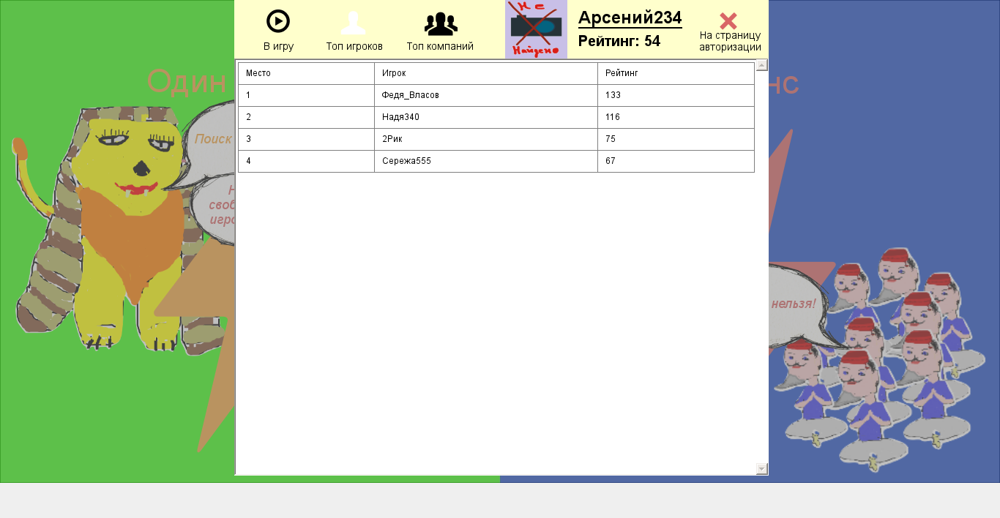
*Топ-лист игроков*

Как говорилось выше, в базе данных хранится информация об отгаданных персонажах. Данная информация представлена в виде таблицы с полями «charname» - имя персонажа и «repeat» - сколько раз этот персонаж был отгадан. Очки расчитываются на основе этих данных следующим образом:
- Если загаданное Сфинксом слово не найдено в базе, то в случае угадывания  игроки получают по +20 очков. Если найдено – по +10 очков.
- Если игра заканчивается по причине истекшего времени, проигравший получает 0 очков, а его соперник +5 очков.

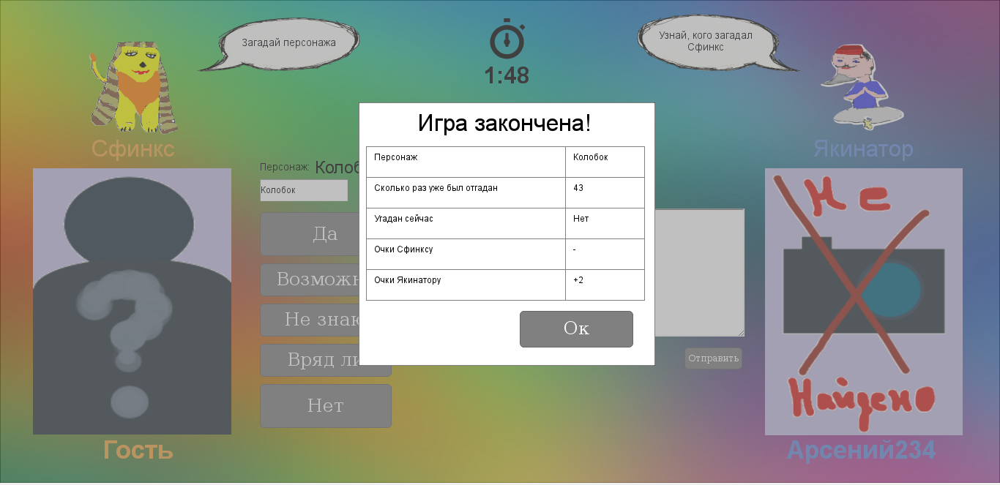
*Окно завершения игры «Один на один»*

В игре «Сеанс» принимает участие один Сфинкс и компания Акинаторов. 

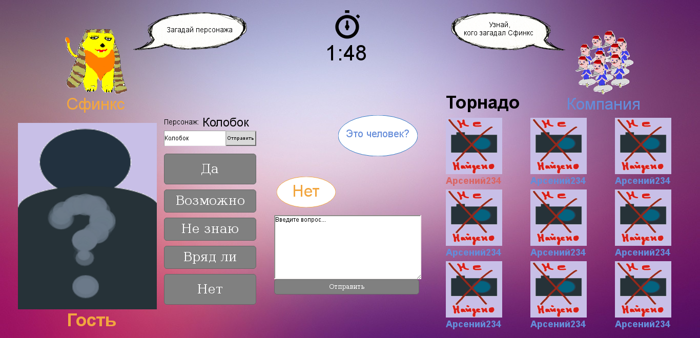
*Игра "Сеанс"*

Компанию может создать любой из зарегистрированных пользователей. Количество игроков в компании ограничено 9 Акинаторами. Создатель компании может пригласить других игроков в свою компанию и удалить их из нее. Другие игроки могут отправлять заявки на принятие в чужие компании. Можно создавать неограниченное количество компаний и состоять в неограниченном количестве компаний. 

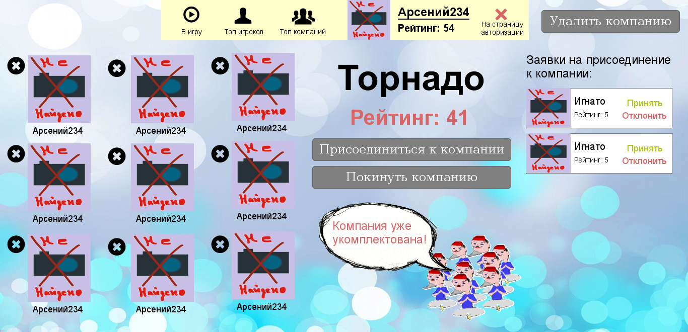
*Страница компании*

В «Якинаторе» формируется отдельный топ-лист лучших компаний. 

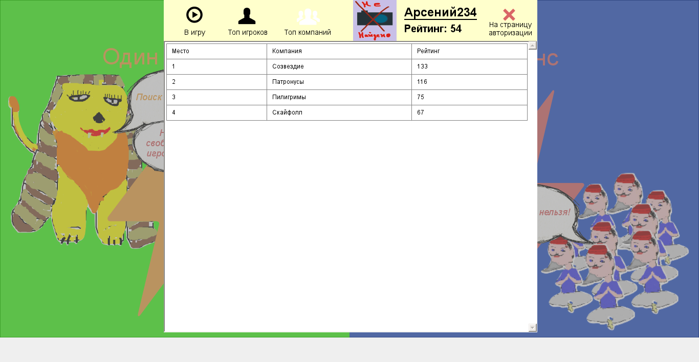
*Топ-лист компаний*

Когда один из членов компании хочет начать «Сеанс», остальные получают от него приглашение в игру.

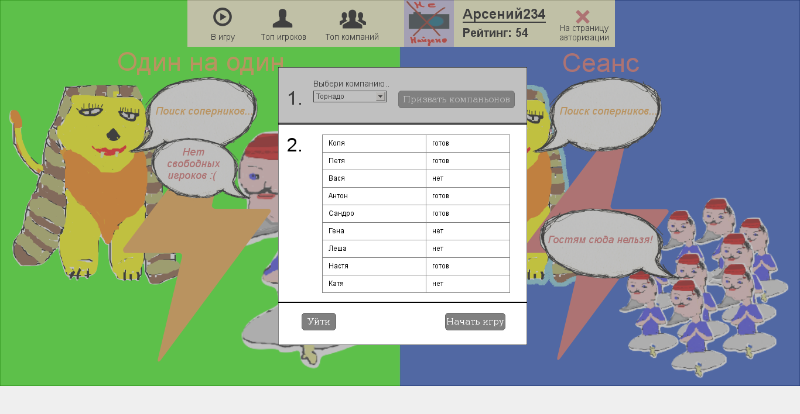
*Окно призыва членов компании на игру*

Правила «Сеанса» очень позожи на игру «Один на один» ввиду лишь нескольких поправок. А именно: Акинаторы по очереди задают вопросы Сфинксу, пока кто-нибудь из них не отгадает персонажа. При чем все члены компании видят вопросы и ответы друг друга, а очередь хода передается другому Якинатору только в случае, если Сфинкс ответил «нет», «вряд ли» или «не знаю». Время на вопрос и ответ ограничено тем же образом, как и в игре «Один на один». Если время закончится у Акинатора, он получает 0 очков и ход ему больше не передается. Если у всех Акинаторов истекло время на ход, игра заканчивается и Сфинкс получает +5 очков, а компания 0 очков. Если у Сфинкса вышло время на ответ, игра заканчивается и все Акинаторы и компания получают по +5 очков. В случае, если в сообщении одного из Акинаторов встречается загаданное слово, персонаж считается отгаданным. Акинаторы и компания получают по +10 очков, Акинатор-победитель и Сфинкс получают +15 очков, если персонаж есть в базе. Если нет, Акинаторы и компания получают по +20 очков, Акинатор-победитель и Сфинкс получают +30 очков.

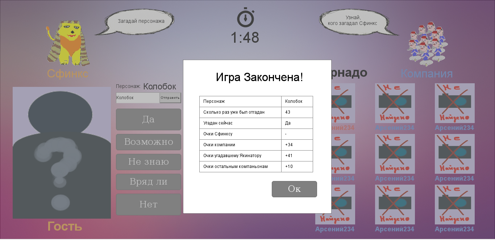
*Окно завершения игры «Сеанс»*

### Роли пользователей
- Гость – неавторизированный пользователь, имеет право на регистрацию и авторизацию в системе, на участие в игре «Один на один» в роли Сфинкса или Акинатора и в «Сеансе» только за Сфинкса без присваивания очков, просмотр чужих профилей и страниц компаний.
- Игрок – авторизованный пользователь, имеет право на участие в игре «Один на один» в роли Сфинкса или Акинатора и в «Сеансе» только за Сфинкса с присваиванием очков, просмотр собственного и чужих профилей, страниц компаний, создание и участие в компаниях.
- Член компании – игрок, состоящий в какой-либо компании, имеет право призывать членов компании на «Сеанс» и играть за компанию. 
- Создатель компании – игрок, создавший компанию, имеет право приглашать и принимать новых членов компании, удалять членов компании.
- Компания – абстрактное действующее лицо, состоящее из игроков – ее членов – выступающих в роли Акинаторов, получает очки за игру в «Сеансе».

### Прецеденты использования

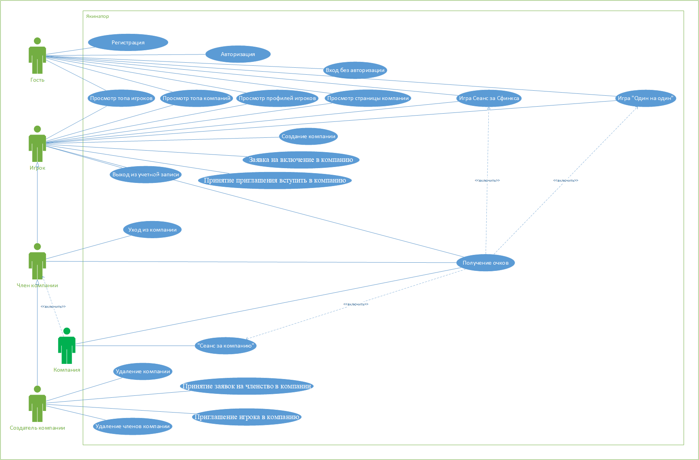
*Общая диаграмма прецедентов использования*

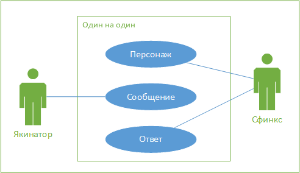
*Диаграмма прецедентов использования системы «Один на один»*

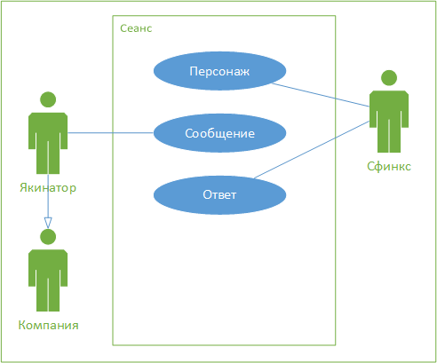
*Диаграмма прецедентов использования системы «Сеанс»*


## Реализация
В структуре проекта находятся основные 6 разделов: Config, Controller, Domain, Service, Repos и Resources. Они отвечают за запросы к базе данных, переход между страницами и бизнес логику.

Логика веб-приложения распределена между сервером и клиентом. Хранение данных осуществляется на сервере, обмен информацией происходит по сети.

### Концептуальная схема

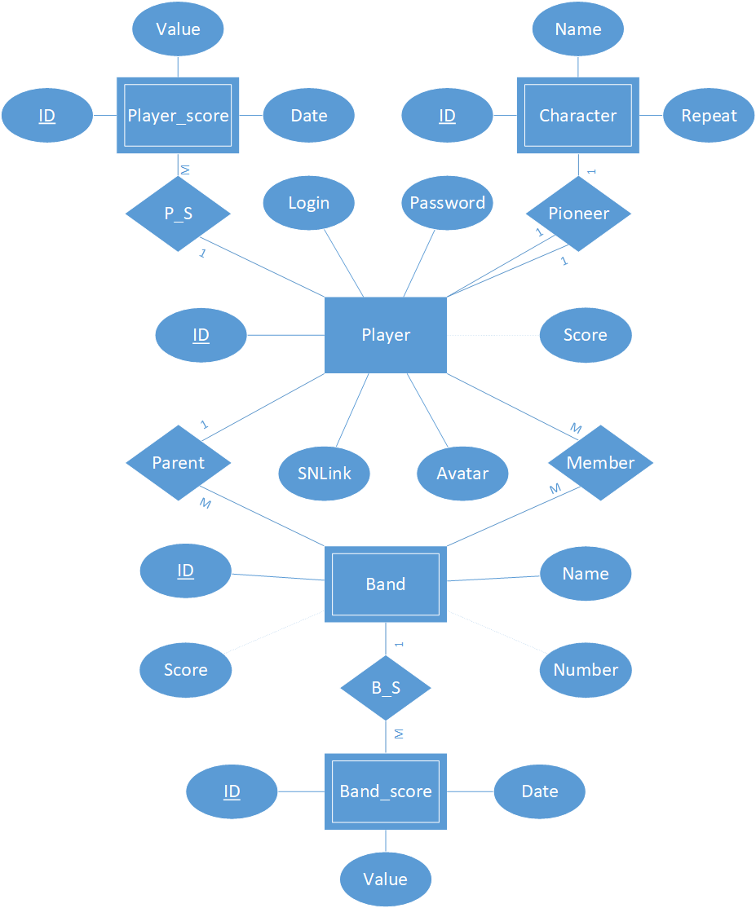
*ER-диаграмма базы данных системы «Якинатор»*

####Сущности и свойства для системы «Якинатор»
- Charcter (Персонаж)
    - ID (Номер) - Идентификационный номер персонажа. Ключевое свойство типа сущности.
    - Name (Имя) - Имя персонажа. Уникальное свойство, которым обладают все экземпляры типа сущности.
    - Repeat (Повторения) - Количество угадываний персонажа. Свойством обладают все экземпляры типа сущности.
- User (Пользователь)
    - ID (Номер) - Идентификационный номер игрока. Ключевое свойство типа сущности.
    - Username (Логин) - Имя учетной записи пользователя. Уникальное свойство, которым обладают все экземпляры типа сущности.
    - Password (Пароль) - Пароль от учетной записи игрока. Свойством обладают все экземпляры типа сущности.
    - Avatar (Аватар) - Имя файла с графическим изображением игрока. У некоторых экземпляров свойство может отсутствовать.
    - SNLink (Ссылка на соц. сеть) - Ссылка на профиль игрока в любой социальной сети. У некоторых экземпляров свойство может отсутствовать.
    - Score (Рейтинг) - Накопленная сумма очков игрока. Вычисляемое свойство, которым обладают все экземпляры типа сущности.
- Band (Компания)
    - ID (Номер) - Идентификационный номер компании. Ключевое свойство типа сущности.
    - Bandname (Название) - Название компании. Уникальное свойство, которым обладают все экземпляры типа сущности.
    - Number (Количество) - Вычисляемое свойство, которым обладают все экземпляры типа сущности.
    - Score (Рейтинг) - Накопленная сумма очков компании. Вычисляемое свойство, которым обладают все экземпляры типа сущности.
- Role
    - Role (Роль) - Роли пользователей

В системе «Якинатор» были выявлены следующие связи между сущностями:
- Band – User (Parent);
- Band – User (Member); 
- Band – User (Seance_invs); 
- Band – User (Player_member_request_band);
- Band – User (Band_member_inv_player).

Все связи являются двухсторонними, т.е. имеют степень два. Связь Parent принадлежит типу один  ко многим, остальные – многие ко многим.

### Логическая схема

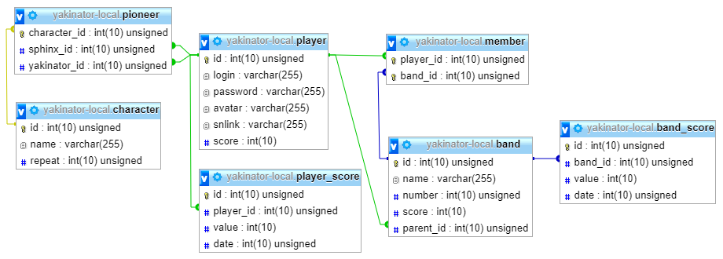
*Логическая схема базы данных системы «Якинатор»*
